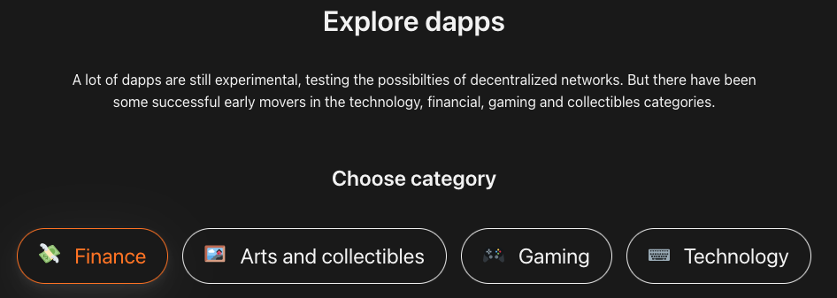
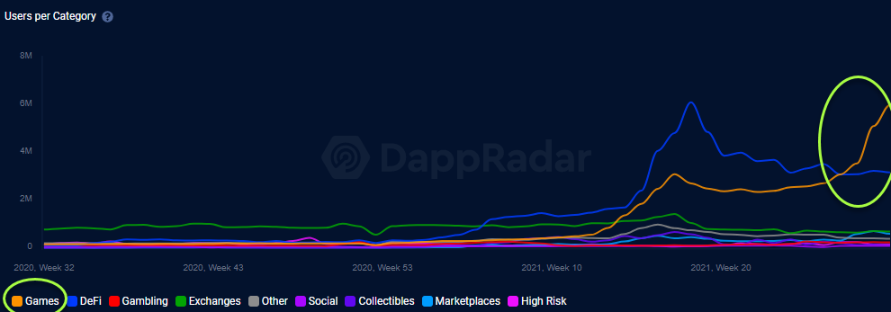
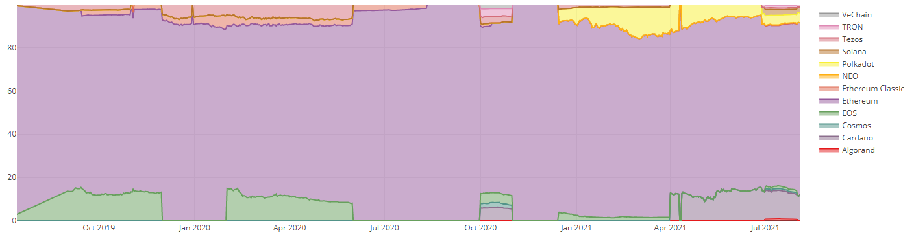
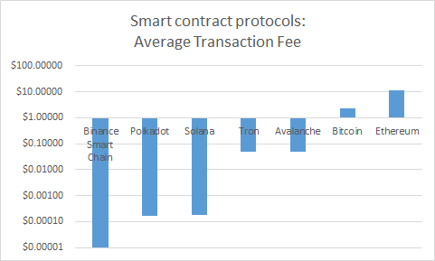
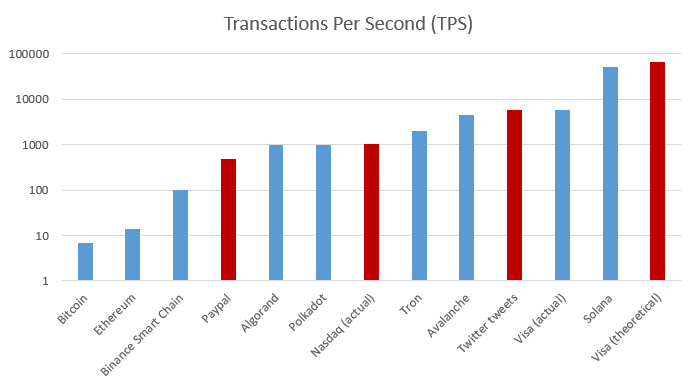

# Overview and Origin
 
The invention of Ethereum created a platform for dApps.  dApps are “decentralized applications” which are programs stored on a blockchain that run applications when predetermined conditions are met.  The Ethereum blog describes it as a “censorship-proof ‘world computer’ that anyone can program, paying exclusively for what they use and nothing more.”  [[Ethereum.org](https://blog.ethereum.org/2015/07/30/ethereum-launches/)] This technology has the potential to revolutionize how people bank, experience art, buy music, use social media, game, manage identities, secure documents, transfer health records, track packages,, and much more.
  

## When was the project founded?
The idea for Ethereum was conceived in 2013 by a Russian-Canadian computer programmer named Vitalik Buterin, and the project went live about 2 years later in July 2015.  
  
## Who are the founders of the company?
The core team of founders include Vitalik Buterin, Charles Hoskinson, Anthony Di Iorio, Mihai Alisie, Amir Chetrit, Gavin Wood, Joseph Lubin, and Jeffre Wilcke. [[Decrypt](https://decrypt.co/36641/who-are-ethereums-co-founders-and-where-are-they-now)]  

The team slowly became fragmented over the years and many of them went on to create other important projects in the blockchain space.  Gavin Wood, who had coded the first working version of Ethereum, went on to start the Web3 Foundation and a new blockchain project called Polkadot.  Charles Hoskinson went on to create Cardano, another smart contract platform.  Joseph Lubin went on to start Consensys, a company that specializes in building dApps on Ethereum. [[Wired](https://www.wired.com/2016/06/the-uncanny-mind-that-built-ethereum/)] 
  

## How did the idea for the project come about?
In 2013 developers were building very basic dApps on Bitcoin, but Vitalkik believed that building on Bitcoin was fundamentally flawed.  Satoshi Nakamot, the creator of Bitcoin, had intentionally coded Bitcoin in an extremely simple programming language for security reasons.  As a result the projects that were being built on Bitcoin were less of a true solution, and more of a hack with a variety of shortcomings.  Vitalik’s idea was to create an entirely new blockchain designed from the ground up to have applications built on top of it by utilizing a “Turing-complete programming language” [[Wired](https://www.wired.com/2016/06/the-uncanny-mind-that-built-ethereum/)].  In 2013, Vitalik wrote up a white paper for his project and named it Ethereum.  
  

## How is the company funded? How much funding have they received?
The original round of funding was done through what is called an ICO, or an Initial Coin Offering.  The founders organized a crowdsale of Ether (Ethereum’s navtive token) in exchange for Bitcoin.  They raised more than 31,000 Bitcoin at about $650 each, for a total of approximately 20 million US dollars. [Wired]
  

# Business Activities:

## What specific financial problem is the company or project trying to solve?

Bitcoin gave us 1st generation blockchains which are global decentralized digital currencies.  This is a very powerful tool, but due to its extremely limited programming nature it is difficult to build applications on.  Ethereum takes blockchain into the 2nd generation by keeping its decentralization and security, but making it much more powerful by adding smart contracts to run a variety applications, an not limited to just banking.

Vitalik is often quoted saying “I discovered that they were doing this sort of swiss army knife approach of supporting 15 different features and doing it in a very limited way”  [[Wired](https://www.wired.com/2016/06/the-uncanny-mind-that-built-ethereum/)].
  

## Who is the company's intended customer?  Is there any information about the market size of this set of customers?

Smart contract blockchain technology has a vast set of use cases, including revolutionizing how people bank, experience art, buy music, use social media, game, manage identities, secure documents, transfer health records, track packages, and much more.  As adoption of this technology grows almost anyone could be a potential user.   

Let’s narrow our scope to just potential users of the current applications available.  The dApps being written on Ethereum right now fall into 4 general categories: financial, art & collectibles , gaming, and technology.
Here you can see options to explore the dApps available on Ethereum. 
  

[[Ethereum.org](https://ethereum.org/en/dapps/#explore)]
  

<b>Finance</b> - Decentralized Finance, or DeFi, is a new type of secure and decentralized banking system built on Ethereum.  This allows users to participate in all types of banking transactions without a centralized single point of failure.  Users can make payments, borrow and lend, earn yield, issue unique digital assets, track real world assets, and more.  Potential users include people interested in: banking alternatives, sending money internationally 24/7, banking without KYC, seeking high yield on their assets, etc.  DeFi has a Total Value Locked of $177B space [[DeFi Llama, Sept 2021](https://defillama.com/home)], where Ethereum makes up $124B of that, or 70%.  [[DeFi Llama, Sept 2021](https://defillama.com/chain/Ethereum)] 
  

<b>Art, Collectibles, & Gaming</b> - Non-Fungible Tokens, or NFTs, are assets on the blockchain that are unique from one another.  They can include digital assets (ie. art, music, images) or a digital representation of real world assets (ie. deeds for real estate, copyrights, stocks, identity management).  The decentralized nature of this platform also allows for intermediaries to be removed and thus creating new markets for creators and audiences to sell directly and simplify transactions.  Communities have a natural tendency to form around NFTs as like minded people are connected directly.  Potential users include: artists, musicians, collectors, sports fans, etc.  Nasdaq estimated NFTs to be a $370B market [[nasdaq.com](https://www.nasdaq.com/articles/why-the-nft-market-could-really-grow-by-1000x-2021-09-05)].
  

<b>Technology</b> - According to [[Ethereum.org](https://ethereum.org/en/dapps/?category=technology)] “these are applications that focus on decentralizing developer tools, incorporating cryptoeconomic systems into existing technology, and creating marketplaces for open-source development work.”  So the potential user here is primarily developers.  According to a report published by dAppros [[dappros.com](https://www.dappros.com/201809/blockchain-developers-worldwide-stats-absolute-vs-relative-to-population/)] in 2018 there were approx 20,587 jobs worldwide specifically for coding just on Ethereum.  This number has surely grown a lot since then.
  

<b>Other</b> - Some other potential users that could include real estate firms, hospitals, delivery & logistics companies, that all want to leverage the secure and decentralized power of tracking assets, deeds, documents, medical records, identities, hospital records, etc.   

This chart gives shows users over time in the various categories of Ethereum use cases.  We can see a spike in DeFi early 2021, and a spike in gaming now (Sept 2021).

[[VanEck](https://www.vaneck.com/us/en/blogs/digital-assets/matthew-sigel-ethereum-competitors-and-the-race-to-innovate/)]
   

## What solution does this company offer that their competitors do not or cannot offer? (What is the unfair advantage they utilize?)

Ethereum’s best offering is selection of dApps, security, and decentralization.  This goes hand in hand with their clear first-mover advantage.  As the first mover, it has the most developers building on its platform and as a result it has the best selection of dApps.  As the first smart contract platform they have the most nodes which helps to keep the network secure and decentralized.  

Ethereum’s first-mover advantage has allowed them to capture the majority of the market share, create strong brand recognition, and build loyalty with its users.  A blog post from VanEck’s website states “Ethereum accounts for 80% of this "smart contract" category.” [[VanEck](https://www.vaneck.com/us/en/blogs/digital-assets/matthew-sigel-ethereum-competitors-and-the-race-to-innovate/)], while Exploding Topics notes that “95% of DApp transaction volume takes place on DeFi Ethereum applications.”  [[Exploding Topics](https://explodingtopics.com/blog/cryptocurrency-trends)]

Here is a market share chart from VanEck’s blog post.  We can see in purple that Ethereum dominates.

[[VanEck](https://www.vaneck.com/us/en/blogs/digital-assets/matthew-sigel-ethereum-competitors-and-the-race-to-innovate/)]
   

## Which technologies are they currently using, and how are they implementing them? (This may take a little bit of sleuthing–– you may want to search the company’s engineering blog or use sites like Stackshare to find this information.)

This is a groundbreaking domain that is built on many types of technologies that came before it.  Here is an incomplete list of some major technologies that are allowing for Ethereum to exist and thrive. 
  

<B>Blockchain</b> - This is the decentralized ledger technology (DLT) that was created with the invention of Bitcoin.  This means that the ledger (database) of transactions is synced, stored, and verified by many different computers which makes it censorship-proof and has no single point of failure.  If one computer goes offline the system is able to continue running, and if a computer tries to publish dishonest transactions the system is able to recognize those false transactions and ignore them.
  

<b>Proof-of-work</b> - Proof-of-work is a consensus mechanism that keeps the network secure.  This computer processing intensive technology requires members to solve mathematical problems in order to run the system.  The incentives are aligned such that a malicious attacker would have to spend a cost prohibitive amount of capital in order to control enough processing power to corrupt the system.
  

<b>Smart Contracts</b> - This is Ethereum’s core innovation where it was the first to utilize smart contract technology in conjunction with blockchain.  Smart contracts are a self-executing piece of software based on specified parameters that are written into its code by developers.  As discussed this has allowed for the creation of not only financial markets, but also markets for art, collectibles, games, and more.
  

# Landscape

## What domain of the financial industry is the company in?
Ethereum is in the Blockchain and DLT (Distributed Ledger Technology) domain.  More specifically it is a 2nd generation smart contract compatible blockchain.
  
## What have been the major trends and innovations of this domain over the last 5-10 years?
 

Here are some big trends we have seen in the last few years.
  

<b>Tokenization of assets</b> - Tokens represent a digital claim to a unique thing or asset.  The major boom we’ve seen has been in the NFT market where art, collectibles, and gaming items. have been tokenized.
  

<b>Institutional adoption</b> - As the space matures, we are starting institution adopt cryptocurrencies and blockchain technology in general.  In the beginning the space primarily consisted of retail investors and speculators, but now we are starting to see institutions take these platforms seriously and begin to invest in them and even put cryptocurrencies on their balance sheet.  In recent years we have seen Grayscale, Microstrategy, Square, Paypal, Galaxy Digital Holdings, and Tesla all put Bitcoin on their balance sheets.  Similarly, we have seen Coinbase, a major US cryptocurrency exchange, become a publicly traded company. 
  

<b>DeFi </b>- DeFi is evolving from an experiment to a real world tool with many use cases.  We saw an explosion in DeFi 2021.  A common metric for measuring the activity and validity of a platform in the DeFi space is its Total Value Locked or TVL.  According to Medium.com “TVL represents the total amount of assets locked in the various DeFi applications smart contracts.”  [[Medium.com](https://medium.com/solana-labs/how-solanas-proof-of-history-is-a-huge-advancement-for-block-time-178899c89723)].  Looking at the charts on DeFi Llama , we can see that $21B TVL in DeFi at the beginning of 2021 vs $174B today (Sept, 2021) [[DeFiLlama.com](https://defillama.com/home)].
  

<b>Stablecoins</b> - Stablecoins date all the way back to 2014 with the introduction of Tether, but they continue to grow in popularity.  Some strong use cases include being able to transact 24/7, it is easily transferable internationally, and transactions clear much faster than traditional bank transfers.

<b>Regulation </b>- Big things are happening in crypto and governments are taking notice.  The space is still only loosely regulated, but we’re seeing governments become more and more involved.  The SEC has hit multiple companies with lawsuits, perhaps most notably Ripple.  Although it has not passed yet, the US has worked language into its Infrastructure Bill targeting DeFi with KYC (Know Your Customer) requirements and more.  El Salvador has now declared Bitcoin legal tender by law.
  

<b>CBDC</b> - CBDCs, or Central Bank Digital Currencies are government issued stablecoins.  China has an outright ban on crypto mining and transactions.  Ironically however, they are the country that is in the lead to create their own CBDC, and has already had two trial programs.  The People’s Bank of China (PBOC) is committed to being a worldwide leader in the adoption of cryptocurrency technology. [Explodingtopics.com]  The US also seems to be flirting with the idea of a CBDC, although nothing is confirmed.  Some speculate that JPMcoin, Stellar Lumens, or Algorand may be promising candidates.
  

<b>Gaming </b>- Gaming is a newer trend that is starting to grow in popularity.  The first blockchain video game is called HashCraft, which was created by Ubisoft in 2019.  Some major games now include Axie Infinity and Zedd Run.  This market overlaps with NFTs. 
  

<b>Some other trends worth noting:</b>
* Governance is evolving
* Supply chain transparency tracked on the blockchain
* Identity management and verification
* Blockchain combined wit AI and machine learning
* Blockchain as-a-service
  

## What are the other major companies in this domain?

Based on Total Value Locked (TVL) here are some noteworthy competitors:

<b>Binance Smart Chain (BSC)</b> - This is the second largest smart contract platform with $16B in TVL, compared to Ethereum which has $120.9B TVL.  This platform has a lot of dApps, is user friendly, and has lower fees than Ethereum.  However, BSC does not have any innovative technologies in place to help it scale better than Ethereum, so BSC will be susceptible to the same shortcomings as Ethereum as its network grows. 
   

<b>Solano (SOL)</b> - Based on TVL, Solano has exploded into the number 3 slot recently with $9B TVL.  It was created by Anatoly Yakovenko who previously worked at Qualcomm and Dropbox.  It uses an innovative Proof-of-History technology that is much faster than existing platforms, which is a true scaling innovation.  Solano recently ran into major stability issues where the entire network needed to be shutdown and rebooted.  This centralized coordination to reboot the network clearly highlights it is still far from decentralized. 
   

<b>Terra (LUNA) </b>- Considering Terra has very few dApps, it surprisingly has the next largest TVL of $8B.  It is possible they have been able to draw in users with their impressive staking platform that yields around 20% on its UST stablecoin.
  

<b>Avalanche (AVAX)</b> - With $4B in TVL, Avalanche touts itself as being blazingly fast, low cost, and green.
  

Breaking away from the TVL metric, here are two other very well known competitors.  Both projects have high market caps; however, the platforms are far from finished:
  

<b>Polkadot (DOT) </b>- Although Polkadot is not a fully live network, it is still the 9th largest cryptocurrency by market cap with a value of $28B.  This is most likely because it was created by Gavin Wood, an Ethereum founder that coded its smart contract functionality.  Polkadot’s specialty will be cross-chain interoperability and Web 3.0 functionality.
  

<b>Cardano (ADA) </b>-  This crypto just launched its first stablecoin and has almost no dApps, yet it still ranks 4th by market cap at $65B.  Again, this is most likely because it was created by another founder of Ethereum, Charles Hoskinson.
  

<b>Other Smart Contract Platforms:</b>
* EOS
* Tron
* Cosmos
* Algorand
* Ethereum Classic (a fork of Ethereum)

  
# Results

## What has been the business impact of this company so far?

Ethereum has given birth to multiple industries and brought a platform for decentralized services to the world.  A variety of new markets have been created which we have already discussed (DeFi, NFTs, gaming, technology, etc.).  In addition to those markets Ethereum has also indirectly helped create jobs for many developers.  According to a report published by dappros.com in 2018 there were approx 20,587 jobs worldwide specifically for coding just on Ethereum [[dappros.com](https://www.dappros.com/201809/blockchain-developers-worldwide-stats-absolute-vs-relative-to-population/)] .  That number has surely grown massively since.  Ethereum’s innovation allowed for the first Stablecoin which gives businesses the ability to transact globally 24/7 and settle transactions faster than traditional finance.
  
## What are some of the core metrics that companies in this domain use to measure success? How is your company performing, based on these metrics?

There are many different metrics to measure a platform’s success, but in my findings there are two primary metrics that are most valuable to actual users: transaction fees and transaction speed.  This is where Ethereum’s weaknesses start to show. 
  

<b>Transaction Fees</b> - Probably the most important metric to the actual end user is fees.  According to Ycharts in Sept 2021 the average Ethereum transaction fee was $3.8/tx compared [[Ycharts](https://ycharts.com/indicators/ethereum_average_transaction_fee)], and Binance Smart Chain at $0.27/tx [[YCharts](https://ycharts.com/indicators/binance_smart_chain_average_transaction_fee_es)].  From a Medium.com Avalanche’s average fee was $0.043/tx [[Medium.com](https://patricio-lopez-75857.medium.com/how-much-cost-use-the-avalanche-c-chian-c358292c6436)], and according to Solberg Invest Solano boasts a miniscule $0.00025/tx [[Solber Invest](https://solberginvest.com/blog/how-much-are-solana-fees/)].  Although these metrics are a constantly moving target, it is clear that Ethereum is much more expensive than its two closest competitors.  Ehtereum’s transaction fee, or “gas” fee, even spiked up to $60/tx in last year [Ycharts.com].
  

This graph the story that Ethereum is much more expensive compared to its closest competitors.

[[VanEck](https://www.vaneck.com/us/en/blogs/digital-assets/matthew-sigel-ethereum-competitors-and-the-race-to-innovate/)]
  

<b>Transaction Speed </b>- This can be a very misleading metric with inconsistencies across the internet which often makes it a topic for heated debate.  New projects coming onto the market commonly boast blazing fast speeds based on mathematics that have yet to hit the bottlenecks of the real world.  This metric is often measured in transaction per second or TPS and transaction time (related to block time).  An article by Forkast published in August 2021 compares some of the fastest cryptos.  Ethereum’s speed is about 13 TPS, and a transaction time of about 11 seconds.  Currently the fastest crypto based on TPS appears to be Solano with a whopping 50,000 TPS possible, however the real world transaction time is about 2.5 seconds.  Another crypto known for speed is Ripple with throughput of about 1,500 TPS, and a transaction time of about 4s.  Avalanche’s TPS is about 5,000 TPS, but achieves an extremely fast transaction time of 1-2 seconds.  Bitcoin is exceptionally slow with a TPS of about 7, and a transaction time of a whopping 10 minutes.  A blog post on Gemeni.com states that Ethereum’s transition to Ethereum 2.0 hopes to boost their speed to 10,000 TPS by switching from proof-of-work to proof-of-stake.  
 

[[VanEck](https://www.vaneck.com/us/en/blogs/digital-assets/matthew-sigel-ethereum-competitors-and-the-race-to-innovate/)]

A very cool website called txstreet.com visually displays the transactions taking place on the blockchain in real time.  The website is a scene at a bus stop where it likens the transaction to people, and the blocks to busses leaving the station.  We can see Ethereum has more than 75,000 transactions pending and an average fee of $8.03, while Bitcoin has 3,597 transactions pending and an average fee of $0.47. (Sept 30, 2021).
  

[[TX Street](https://txstreet.com/)]
  

Here are some other useful metrics to consider:
  

<b>Market Cap </b>- Ethereum is the second largest cryptocurrency in the world with a market cap of $333B (Sept 2021) according to CoinGecko, 2nd only to Bitcoin.
  

<b>Total Value Locked (TVL) </b> - Ethereum has about $124B of TVL in its DeFi space.  This is the largest by far compared to its competitors, with Binance Smart Chain is 2nd with $16B TVL.  (DefiLlama, Sept 2021)
  

<b>Number of dApps</b> - According a Coin Desk article published in Feb 2021, Ethereum has over 3,000 dApps on its platform.
    

<b>Decentralization </b>- The higher the number of validators, the more decentralized a network is considered.  According to an article published by Hackermoon in March 2021, Ethereum has about 3,481 validator nodes [[Etherscan](https://etherscan.io/nodetracker#)], compared to Solano that has 1087 [[Solanobeach.io](https://solanabeach.io/)], and Binance Smart Chain which only has 21 [[Binance.org](https://docs.binance.org/smart-chain/validator/guideline.html)].  Ethereum here is far more decentralized than both of these, however this also makes the Ethereum slower.
  

<b>Active Wallet Addresses </b>- According to data gathered from Bitinfocharts in Sept, 2021, Ethereum had approx 723,00 active wallet addresses in a 24 hour span.  Compared to other cryptocurrency at the exact same time, Bitcoin had 751,000, Litecoin had 308,000, Bitcoin Cash had 79,000, and Dogecoin had 45,486.  It was difficult to find a comparison of this data with multiple currencies within the same relevant time period.  [[BitInfoCharts.com](https://bitinfocharts.com/)]
  

## How is your company performing relative to competitors in the same domain?

Ethereum is performing well compared to its competitors, but this is largely due to its first mover advantage.  It has the most market share by far, the largest selections of dApps, the most TVL, and is very decentralized, but as highlighted in the segment on metrics they have much slower speeds and higher fees than its closest competitors.  

Ethereum is constantly being updated and has big improvements in the works to address its slower speed and higher fees.  In Ethereum 2.0, several new technologies will be introduced to combat these issues.  The big question is will it come soon enough before competitors are able to significantly cut into its market share.  A blog post by VanEck put it very succinctly  “However, in the absence of capacity increases, which don't arrive until 2022, ETH could struggle to hold market share vs. competing smart contract protocols that promise faster throughput at lower prices.”  [VanEck]

In the meantime, layer-2 solutions like Polygon (Matic) are helping to relieve the congestion by handling transactions off the Ethereum Mainnet (layer-1), but still leveraging the robust decentralization and security of Ethereum’s Mainnet
  

# Recommenations

## If you were to advise the company, what products or services would you suggest they offer?  What technologies would this additional product or service utilize?  (This could be something that a competitor offers, or use your imagination!)
 

Speaking at a conference in San Francisco in 2017 Vitalik said “one of her Ethereum's slogans right from the start has actually been we have no features.”  Since Ethereum doesn’t actually develop any of its own dApps, it doesn’t have a good substitute for products and services, so let’s instead look at some technologies that Ethereum could implement to address its biggest weaknesses.
  

<b>Sharding </b>- Currently every node needs to confirm every transaction which is inefficient and therefore slows down the system.  Sharding is a technology where the transactions can be broken up and distributed among the nodes so that not every node needs to approve every transaction and thus increasing the networks’s speed.
  

<b>Proof-of-stake </b> - Proof-of-stake is a consensus mechanism where nodes “stake” large sums of money as collateral to keep the node honest.  Any computer that is dishonest and tries to corrupt the network would have their stake confiscated which is called “slashing.”  The aligns the economic incentives so that being dishonest is very cost prohibitive.  It is also much greener, because the process does not demand a lot of computation power and energy like the proof-of-work consensu mechanism.  

Wikipedia ties these two very technical concepts together nicely by saying “The stated goal is to increase throughput by splitting up the workload into many blockchains running in parallel (referred to as sharding) and then having them all share a common consensus proof-of-stake blockchain, so that to maliciously tamper with any singular chain would require one to tamper with the common consensus, which would cost the attacker far more than they could ever gain from an attack.” [Wiki]

The technologies above are both planned to be implemented in Ethereum 2.0.  Here are some other technologies that competitors have implemented that could also have a positive impact.
  

<b>Proof-of-history </b>- This appears to be a breakthrough in blockchain scaling solutions.  Medium.com explains this very technical concept well:  “Whereas other blockchains require validators to talk to one another in order to agree that time has passed, each Solana validator maintains its own clock by encoding the passage of time in a simple SHA-256, sequential-hashing verifiable delay function (VDF)” [[Medium.com](https://medium.com/solana-labs/how-solanas-proof-of-history-is-a-huge-advancement-for-block-time-178899c89723)].  Essentially the validator nodes don’t need to communicate with each other to prove that a transaction is valid, rather the SHA-256 timestamp is proof that the transaction is legitimate.  This upgrade would be in addition to proof-of-stake, and not a substitute despite the similar name.  
  

<b>Relay Chain </b>- Another capability that could be profoundly useful is Interoperability, which is the ability for blockchains to interact with one another.  Generally speaking, blockchains are not made to interact and share data with one another.  Existing technologies (like wrapped tokens, bridges, and atomic swaps) are cumbersome, and for many blockchains interoperability is not even possible.  One solution would be to create a main “relay chain” where Ethereum would plug into as a single chain, and another chain could plug into the same relay chain to have seamless communication.  Imagine a bike wheel, where the hub is the relay chain and the spokes are individual blockchains.  The Ethereum blockchain (spoke) plugged into the relay chain (hub), but then it could seamlessly communicate and share data with all the other blockchains (spokes) connected to the relay chain.  This technology is currently being developed by Polkadot and the Web3 Foundation.
  

## Why do you think that offering this product or service would benefit the company?  Why are these technologies appropriate for your solution?
 

The benefits of implementing the above technologies would help tackle some of Ethereum’s biggest problems.  
 

<b>Transaction Speed </b>- Sharding, proof-of-stake, and proof-of-history will all make the network more efficient, and thereby increasing the transaction speed.
  

<b>Reduce Fees </b>-  Transaction fees are elastic and increase when the network is busy and decrease when the network is slow.  By improving the efficiency of the network, you are effectively also lowering the transaction fees.
  

<b>Interoperability</b> - This feature will become more and more important as Web 3.0 evolves and users need to interact with data on another chain, such as supply chain records, health records, certificates, and so on.